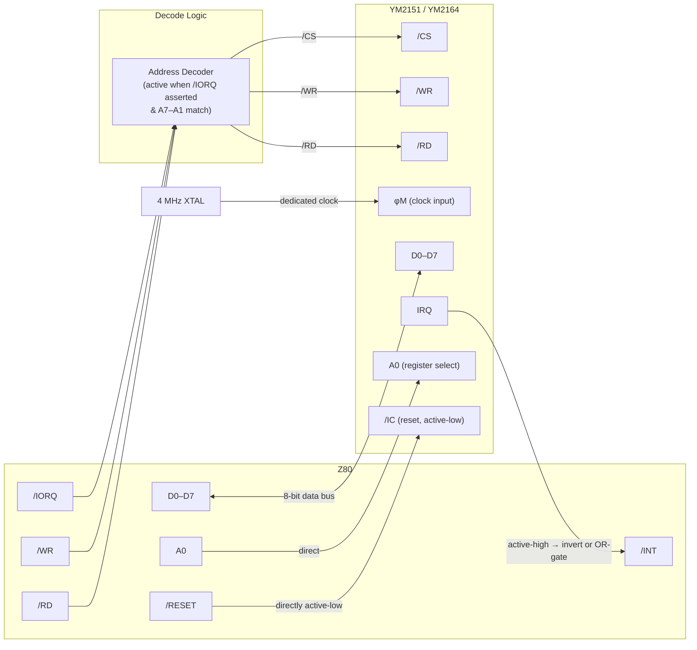

# Yamaha YM2151 / YM2164 (OPM) — Hardware Interface Specification

## Overview

| Property | YM2151 | YM2164 |
|---|---|---|
| Designation | OPM | OPP |
| Synthesis | 4-operator FM | 4-operator FM |
| Channels | 8 voices | 8 voices |
| Audio Output | Stereo (L + R) | Stereo (L + R) |
| Data Bus | 8-bit | 8-bit |
| Address Lines Used | 1 (A0 only) | 1 (A0 only) |

## Clock

- Requires a dedicated external crystal/oscillator.
- Typical clock: **4 MHz** (as used in the Yamaha FB-01).
- The clock is independent of the CPU clock.

## Pin-Level Bus Interface (Z80 Perspective)

The chip uses a single address line (directly, or decoded from the Z80 I/O address bus) to select between two registers:

| A0 | Direction | Function |
|---|---|---|
| `0` | Write only | **Address Register** — latches the internal register number (0x00–0xFF) for subsequent data write |
| `1` | Read | **Status Register** — returns chip status byte |
| `1` | Write | **Data Register** — writes data to the previously addressed internal register |

### Minimal Z80 I/O Mapping

Only two consecutive I/O port addresses are needed:

| Z80 I/O Port | R/W | OPM Function |
|---|---|---|
| Base + 0 | W | `address_w(data)` — write register address |
| Base + 1 | R | `status_r()` — read status byte |
| Base + 1 | W | `data_w(data)` — write register data |

In the FB-01 implementation, these are mapped at I/O ports `0x00` and `0x01`.

### Accent on the Write Protocol

Writing to an internal register is a **two-step** operation:

1. Write the target register number to the **Address port** (A0=0).
2. Write the data value to the **Data port** (A0=1).

There is no read-back of internal registers; only the status register is readable.

## Status Register (Read at A0=1)

| Bit | Name | Description |
|---|---|---|
| 7 | BUSY | `1` = chip is processing a write; CPU must wait before next write |
| 1 | Timer B Flag | `1` = Timer B has overflowed |
| 0 | Timer A Flag | `1` = Timer A has overflowed |
| 6–2 | — | Unused / reserved |

The CPU should poll bit 7 (BUSY) after each data write to ensure the chip is ready for the next operation.

## Reset Line

| Signal | Level | Behaviour |
|---|---|---|
| /RESET (active LOW) | LOW (asserted) | Chip is held in reset; **all writes are ignored** (address, data, and combined write calls return immediately with no effect) |
| /RESET | HIGH (released) | Chip performs an internal reset (`m_chip.reset()`) and becomes operational |

- Reset is **asynchronous** — it can be asserted/released independently of the clock.
- The default (power-on) state is `m_reset_state = 1` (not in reset, chip is active).
- The YM2164 variant does **not** expose a separate software-controllable reset line in this implementation.

## IRQ Output

- The OPM has an **IRQ output pin**, directly usable with the Z80 `/INT` line.
- Directly active-high compatible with Z80 interrupt input.
- IRQ is asserted when Timer A or Timer B overflows (and the corresponding interrupt enable bit is set in the OPM's internal registers).
- In a typical system, this is **directly wired** or **active-OR combined** with other interrupt sources onto the Z80 INT line.

## General-Purpose Output Port (CT1/CT2)

- The OPM provides a **port write handler** (`port_write_handler()`) — an 8-bit output port exposed via CT1 and CT2 pins.
- These are directly accessible from OPM internal register `0x1B`.
- Can be used for auxiliary control (e.g., ADPCM bank switching in arcade hardware).

## Audio Output

- **Stereo output:** Two analog channels (Left and Right).
- In the FB-01, both channels are routed at full gain (1.00) to a stereo speaker configuration.

## Timing Considerations for Z80 Interfacing

1. **BUSY flag polling:** After writing data to the Data port, the CPU must check the BUSY bit (bit 7 of the status register) before issuing the next write. Typical busy duration is ~68 internal clock cycles (~17 µs at 4 MHz).
2. **Address write does not set BUSY:** Writing to the address port is instantaneous and does not require a BUSY check.
3. **Reset hold time:** The chip must be held in reset for a sufficient duration for internal state to clear before releasing.

## Summary: Minimal Wiring to Z80

### Accent Accent Accent Decoded I/O Address Example (FB-01 style)

With the Z80's 8-bit I/O space (`global_mask(0xFF)`):

| Address Lines | Accent Accent Decoded Port | Function |
|---|---|---|
| A7–A1 = `0000000`, A0 = `0` | `0x00` | OPM Address Write |
| A7–A1 = `0000000`, A0 = `1` | `0x01` | OPM Status Read / Data Write |

## Differences Between YM2151 and YM2164

| Feature | YM2151 | YM2164 |
|---|---|---|
| Software reset line | Yes (`reset_w`) | Not exposed in this implementation |
| Write gating on reset | Yes (writes ignored while reset asserted) | Inherited from base class (no override) |
| Port write handler | Yes (`port_write_handler`) | Yes (`port_write_handler`) |
| Internal register set | Standard OPM | Extended OPP (minor differences in register map) |
